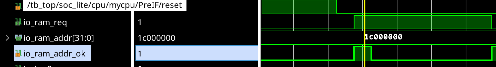

## 设计
### 特权指令，例外与中断
#### 特权指令
将 csr 与流水线的交互都放在 es。  
中断例外，跳转分支，都在 es 级处理，保证 fs 至多丢弃一次数据。  
~~ex 在执行 csrwr, csrxchg 指令时，需要将 es 阻塞一拍，目的是处理 ds 的写后读冲突。将 csr 原来的值取出来发给 ms 以写 gpr.~~  
感觉不如读写都在 es。  
需要注意，如果已经写好了 csr 但是 es 仍然阻塞，需要确保 es 取出的值仍然是旧值。

#### 例外
1. ADEF 0 取指地址错例外。 在 pf 检查 next_pc, 若触发例外，就不再发取指请求，并且拉起 ice，直到 es 发 br 的时候清空 ice，下一拍继续正常取指。    
但是有可能，当 pf 发现例外的时刻，其实前面有未执行的跳转指令。所以 br 的时候要一并清除之前流水级的异常情况，并且所有例外都要在 es 实际触发。  

2. ALE 地址非对齐例外。 在 es 检查，若触发例外，就不写数据，并且执行例外处理流程。  

3. BRK 例外，SYS 例外，INE 例外。都是在 ds 中检查。 

#### 中断：
软件中断，硬件中断。都由 csr 判断，如果需要处理中断，就直接把 ds 正在执行的指令标记为例外指令。之所以不直接给 es，是因为 es 可能在和 sram_slave 交互，避免出现需要 ms 丢弃结果的情况出现。并且由于 es 可能阻塞的缘故，ds 需要用一个寄存器保存有没有收到中断。 还有可能给 ds 发中断的时候，ds 内没有有效的指令，要确保中断成功发送到 es 才能，并且冲刷流水级也不能冲掉这个寄存器。

#### 总结
pf, fs, ds 向下一级发送的 bus 应该增加 evalid, ecode 两个信号，~~当前流水级增加一个 ice 状态，如果当前流水级上是一条例外指令，就不再发送请求/接收前一个流水级的信号。  ~~其实没必要，因为就算继续取指令，也不可能超过触发例外的指令。而跳转的时候会冲刷掉新取的指令。

例外指令 / 到 es 级的时候，执行以下操作:  
1. 告知 csr，执行例外处理过程。  
2. 从 csr 获得例外入口地址，和 branch 一样执行跳转。  

## 日记
### 6月1日凌晨
本来想先接 cpu 实战上的类 sram 的。我自以为重构的代码还是很清晰了，但是第一条指令都取不出来... 看了一下他的实现，虽然确实可以随机延迟出 ok_addr，但是和我发请求同一拍，甚至还没请求就回复 ok，完全是意料不到的事情啊。还是明天自己写一个状态机直接接 AXI 吧，至少我自己写从端肯定不会有这种情况 =。=

### 6月1日晚上
重构代码之后，AXI 接成功了，不过目前只是一个不考虑相关冲突的五级流水线。

### 6月4日
soc-simulator 移植好了，又可以快乐调波形了。^-^
